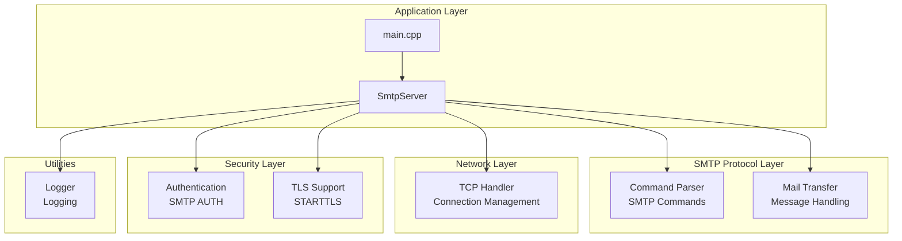
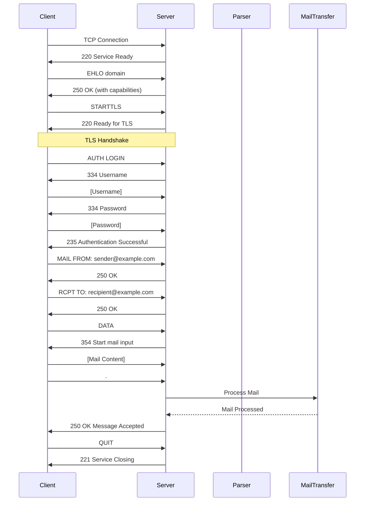

# Simple SMTP Daemon - Architecture Diagrams

## System Architecture

```mermaid
graph TB
    subgraph "Application Layer"
        Main[main.cpp]
        Server[SmtpServer]
    end
    
    subgraph "SMTP Protocol Layer"
        CommandParser[Command Parser<br/>SMTP Commands]
        MailTransfer[Mail Transfer<br/>Message Handling]
    end
    
    subgraph "Network Layer"
        TCPHandler[TCP Handler<br/>Connection Management]
    end
    
    subgraph "Security Layer"
        Auth[Authentication<br/>SMTP AUTH]
        TLS[TLS Support<br/>STARTTLS]
    end
    
    subgraph "Utilities"
        Logger[Logger<br/>Logging]
    end
    
    Main --> Server
    Server --> CommandParser
    Server --> MailTransfer
    Server --> TCPHandler
    Server --> Auth
    Server --> TLS
    Server --> Logger
```

## SMTP Mail Transfer Flow

```mermaid
sequenceDiagram
    participant Client
    participant Server
    participant Parser
    participant MailTransfer
    
    Client->>Server: TCP Connection
    Server->>Client: 220 Service Ready
    
    Client->>Server: EHLO domain
    Server->>Client: 250 OK (with capabilities)
    
    Client->>Server: STARTTLS
    Server->>Client: 220 Ready for TLS
    Note over Client,Server: TLS Handshake
    
    Client->>Server: AUTH LOGIN
    Server->>Client: 334 Username
    Client->>Server: [Username]
    Server->>Client: 334 Password
    Client->>Server: [Password]
    Server->>Client: 235 Authentication Successful
    
    Client->>Server: MAIL FROM: sender@example.com
    Server->>Client: 250 OK
    
    Client->>Server: RCPT TO: recipient@example.com
    Server->>Client: 250 OK
    
    Client->>Server: DATA
    Server->>Client: 354 Start mail input
    Client->>Server: [Mail Content]
    Client->>Server: .
    Server->>MailTransfer: Process Mail
    MailTransfer-->>Server: Mail Processed
    Server->>Client: 250 OK Message Accepted
    
    Client->>Server: QUIT
    Server->>Client: 221 Service Closing
```

