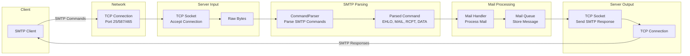
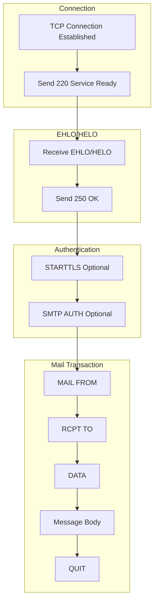

# Simple SMTP Daemon - Data Flow Diagrams

## SMTP Mail Transfer Data Flow

```mermaid
flowchart LR
    subgraph "Client"
        C1[SMTP Client]
    end

    subgraph "Network"
        N1[TCP Connection<br/>Port 25/587/465]
    end

    subgraph "Server Input"
        S1[TCP Socket<br/>Accept Connection]
        S2[Raw Bytes]
    end

    subgraph "SMTP Parsing"
        P1[CommandParser<br/>Parse SMTP Commands]
        P2[Parsed Command<br/>EHLO, MAIL, RCPT, DATA]
    end

    subgraph "Mail Processing"
        MP1[Mail Handler<br/>Process Mail]
        MP2[Mail Queue<br/>Store Message]
    end

    subgraph "Server Output"
        O1[TCP Socket<br/>Send SMTP Response]
        O2[TCP Connection]
    end

    C1 -->|SMTP Commands| N1
    N1 --> S1
    S1 --> S2
    S2 --> P1
    P1 --> P2
    P2 --> MP1
    MP1 --> MP2
    MP2 --> O1
    O1 --> O2
    O2 -->|SMTP Responses| C1
```

## SMTP Session Flow

```mermaid
flowchart TB
    subgraph "Connection"
        C1[TCP Connection Established]
        C2[Send 220 Service Ready]
    end

    subgraph "EHLO/HELO"
        E1[Receive EHLO/HELO]
        E2[Send 250 OK]
    end

    subgraph "Authentication"
        A1[STARTTLS Optional]
        A2[SMTP AUTH Optional]
    end

    subgraph "Mail Transaction"
        M1[MAIL FROM]
        M2[RCPT TO]
        M3[DATA]
        M4[Message Body]
        M5[QUIT]
    end

    C1 --> C2
    C2 --> E1
    E1 --> E2
    E2 --> A1
    A1 --> A2
    A2 --> M1
    M1 --> M2
    M2 --> M3
    M3 --> M4
    M4 --> M5
```
