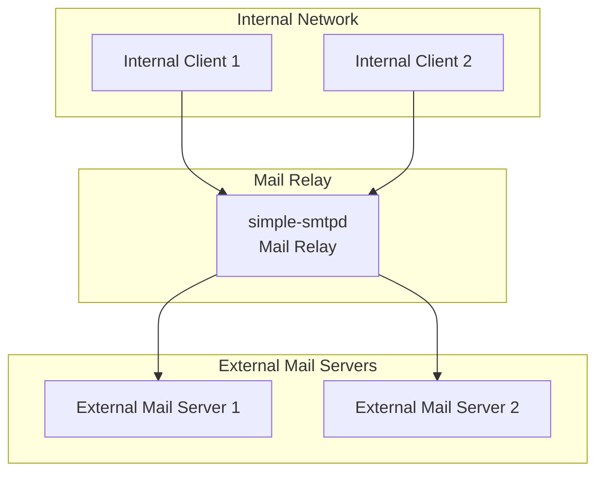

# Simple SMTP Daemon - Deployment Diagrams

## Basic Deployment Architecture

```mermaid
graph TB
    subgraph "Client Network"
        Client1[SMTP Client 1]
        Client2[SMTP Client 2]
        ClientN[SMTP Client N]
    end

    subgraph "SMTP Server"
        Server[simple-smtpd<br/>Main Process]
        Config[/etc/simple-smtpd/<br/>Configuration]
        MailQueue[/var/spool/simple-smtpd<br/>Mail Queue]
        Logs[/var/log/simple-smtpd/<br/>Mail Logs]
    end

    subgraph "System Services"
        Systemd[systemd<br/>Service Manager]
        Logrotate[logrotate<br/>Log Rotation]
    end

    Client1 --> Server
    Client2 --> Server
    ClientN --> Server

    Systemd --> Server
    Systemd --> Config

    Server --> Config
    Server --> MailQueue
    Server --> Logs

    Logrotate --> Logs
```

## Mail Relay Deployment


