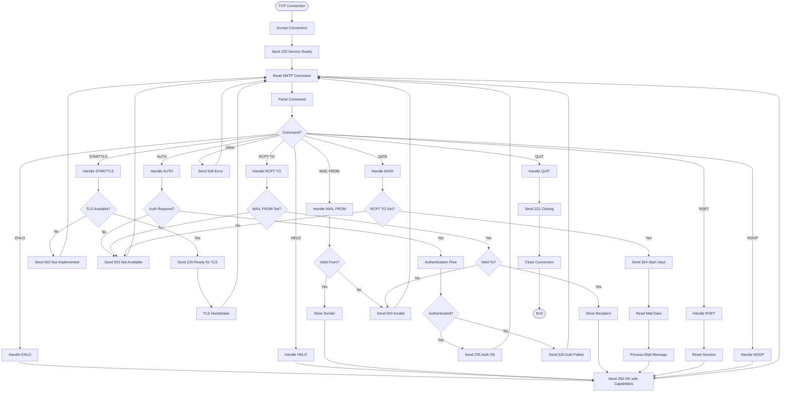
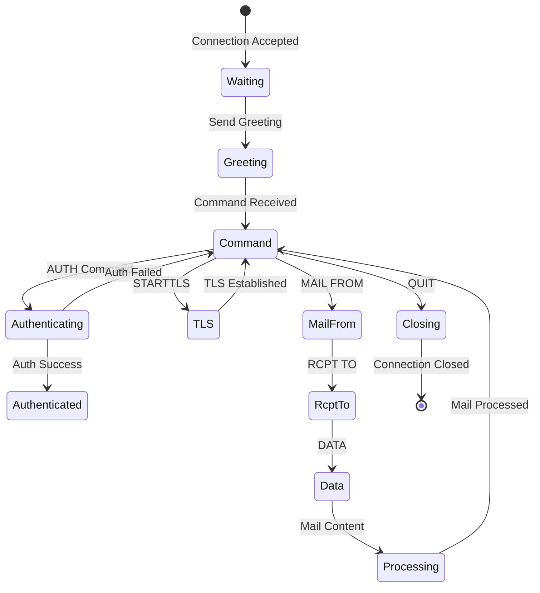

# Simple SMTP Daemon - Flow Diagrams

## SMTP Command Processing Flow

```mermaid
flowchart TD
    Start([TCP Connection]) --> Accept[Accept Connection]
    Accept --> SendGreeting[Send 220 Service Ready]
    SendGreeting --> ReadCommand[Read SMTP Command]
    
    ReadCommand --> Parse[Parse Command]
    Parse --> CheckCommand{Command?}
    
    CheckCommand -->|EHLO| HandleEHLO[Handle EHLO]
    CheckCommand -->|HELO| HandleHELO[Handle HELO]
    CheckCommand -->|STARTTLS| HandleSTARTTLS[Handle STARTTLS]
    CheckCommand -->|AUTH| HandleAUTH[Handle AUTH]
    CheckCommand -->|MAIL FROM| HandleMAIL[Handle MAIL FROM]
    CheckCommand -->|RCPT TO| HandleRCPT[Handle RCPT TO]
    CheckCommand -->|DATA| HandleDATA[Handle DATA]
    CheckCommand -->|RSET| HandleRSET[Handle RSET]
    CheckCommand -->|NOOP| HandleNOOP[Handle NOOP]
    CheckCommand -->|QUIT| HandleQUIT[Handle QUIT]
    CheckCommand -->|Other| Send500[Send 500 Error]
    
    HandleEHLO --> Send250[Send 250 OK with Capabilities]
    HandleHELO --> Send250
    
    HandleSTARTTLS --> CheckTLS{TLS Available?}
    CheckTLS -->|Yes| Send220TLS[Send 220 Ready for TLS]
    CheckTLS -->|No| Send502[Send 502 Not Implemented]
    Send220TLS --> TLSHandshake[TLS Handshake]
    TLSHandshake --> ReadCommand
    
    HandleAUTH --> CheckAuth{Auth Required?}
    CheckAuth -->|No| Send503[Send 503 Not Available]
    CheckAuth -->|Yes| AuthFlow[Authentication Flow]
    AuthFlow --> AuthOK{Authenticated?}
    AuthOK -->|Yes| Send235[Send 235 Auth OK]
    AuthOK -->|No| Send535[Send 535 Auth Failed]
    
    HandleMAIL --> ValidateFrom{Valid From?}
    ValidateFrom -->|Yes| StoreFrom[Store Sender]
    ValidateFrom -->|No| Send550[Send 550 Invalid]
    StoreFrom --> Send250
    
    HandleRCPT --> CheckFrom{MAIL FROM Set?}
    CheckFrom -->|No| Send503
    CheckFrom -->|Yes| ValidateTo{Valid To?}
    ValidateTo -->|Yes| StoreTo[Store Recipient]
    ValidateTo -->|No| Send550
    StoreTo --> Send250
    
    HandleDATA --> CheckRCPT{RCPT TO Set?}
    CheckRCPT -->|No| Send503
    CheckRCPT -->|Yes| Send354[Send 354 Start Input]
    Send354 --> ReadData[Read Mail Data]
    ReadData --> ProcessMail[Process Mail Message]
    ProcessMail --> Send250
    
    HandleRSET --> ResetSession[Reset Session]
    ResetSession --> Send250
    
    HandleNOOP --> Send250
    
    HandleQUIT --> Send221[Send 221 Closing]
    Send221 --> Close[Close Connection]
    
    Send500 --> ReadCommand
    Send502 --> ReadCommand
    Send503 --> ReadCommand
    Send550 --> ReadCommand
    Send535 --> ReadCommand
    Send250 --> ReadCommand
    Send235 --> ReadCommand
    Close --> End([End])
```

## SMTP Session State Machine

```mermaid
stateDiagram-v2
    [*] --> Waiting: Connection Accepted
    Waiting --> Greeting: Send Greeting
    Greeting --> Command: Command Received
    Command --> Authenticating: AUTH Command
    Authenticating --> Authenticated: Auth Success
    Authenticating --> Command: Auth Failed
    Command --> TLS: STARTTLS
    TLS --> Command: TLS Established
    Command --> MailFrom: MAIL FROM
    MailFrom --> RcptTo: RCPT TO
    RcptTo --> Data: DATA
    Data --> Processing: Mail Content
    Processing --> Command: Mail Processed
    Command --> Closing: QUIT
    Closing --> [*]: Connection Closed
```

