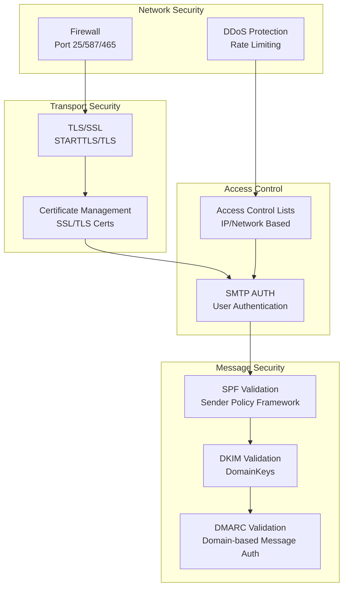
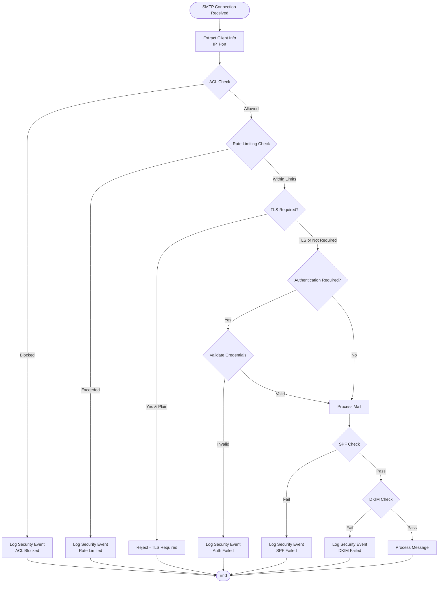

# Simple SMTP Daemon - Security Diagrams

## Security Architecture

```mermaid
graph TB
    subgraph "Network Security"
        Firewall[Firewall<br/>Port 25/587/465]
        DDoSProtection[DDoS Protection<br/>Rate Limiting]
    end

    subgraph "Transport Security"
        TLS[TLS/SSL<br/>STARTTLS/TLS]
        Certificate[Certificate Management<br/>SSL/TLS Certs]
    end

    subgraph "Access Control"
        ACL[Access Control Lists<br/>IP/Network Based]
        Auth[SMTP AUTH<br/>User Authentication]
    end

    subgraph "Message Security"
        SPF[SPF Validation<br/>Sender Policy Framework]
        DKIM[DKIM Validation<br/>DomainKeys]
        DMARC[DMARC Validation<br/>Domain-based Message Auth]
    end

    Firewall --> TLS
    DDoSProtection --> ACL

    TLS --> Certificate
    Certificate --> Auth

    ACL --> Auth
    Auth --> SPF
    SPF --> DKIM
    DKIM --> DMARC
```

## Security Flow

```mermaid
flowchart TD
    Start([SMTP Connection Received]) --> ExtractInfo[Extract Client Info<br/>IP, Port]

    ExtractInfo --> ACLCheck{ACL Check}
    ACLCheck -->|Blocked| LogBlock1[Log Security Event<br/>ACL Blocked]
    ACLCheck -->|Allowed| RateLimitCheck

    RateLimitCheck{Rate Limiting Check}
    RateLimitCheck -->|Exceeded| LogBlock2[Log Security Event<br/>Rate Limited]
    RateLimitCheck -->|Within Limits| TLSCheck

    TLSCheck{TLS Required?}
    TLSCheck -->|Yes & Plain| RejectTLS[Reject - TLS Required]
    TLSCheck -->|TLS or Not Required| AuthCheck

    AuthCheck{Authentication Required?}
    AuthCheck -->|Yes| ValidateAuth{Validate Credentials}
    AuthCheck -->|No| ProcessMail

    ValidateAuth -->|Invalid| LogBlock3[Log Security Event<br/>Auth Failed]
    ValidateAuth -->|Valid| ProcessMail

    ProcessMail[Process Mail] --> SPFCheck{SPF Check}
    SPFCheck -->|Fail| LogBlock4[Log Security Event<br/>SPF Failed]
    SPFCheck -->|Pass| DKIMCheck

    DKIMCheck{DKIM Check}
    DKIMCheck -->|Fail| LogBlock5[Log Security Event<br/>DKIM Failed]
    DKIMCheck -->|Pass| ProcessMessage

    ProcessMessage[Process Message] --> End([End])

    LogBlock1 --> End
    LogBlock2 --> End
    LogBlock3 --> End
    LogBlock4 --> End
    LogBlock5 --> End
    RejectTLS --> End
```
